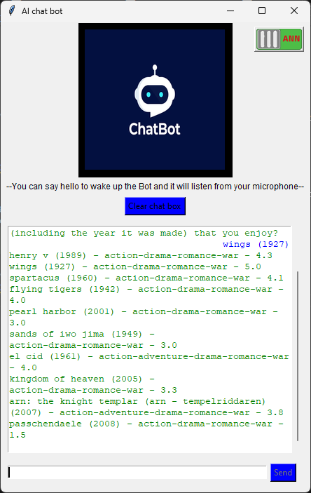

# **🌟 AI_Assistant App 🌟**

## **Description**

   - This application is a chatbot developed by Trần Đức Thuận.  
   - You can interact with the application both by voice and through the chatbox.  
   - The supported languages are English ( Vietnamese with be update soon :3).  
   - Since this is a personal project, many other interesting features will be updated in the future. Thank you for following the project.  


## **App features**
## Table of features

✅ [Chat bot](#Chat-bot)  
✅ [Remove background from image](#Remove-background-from-image)  
✅ [Voice control](#Voice-control-(Speech-to-text))  
✅ [Movie recommendations](#Movie-recommendations)  
✅ [Age prediction](#Age-prediction)  
✅ [Respond with voice](#Respond-with-voice-(text-to-speech))  
✅ [Open and close application](#Open-and-close-application)  
✅ [Google custom search](#Google-custom-search)  
✅ [Some commands](#Some-commands)  

## Chat bot

   - The application utilizes the LLM (llama 2) model and a RAG technique to enhance LLM's knowledge with additional data.  
   - You can switch to LLM answering mode using a toggle button in the top right corner.  
   - Due to limited data, the model currently answers only specific fields available in the data (current data pertains to Python bugs).  
     
 

   - However, you can use the ANN answering mode for clearer responses.  
      For example: What can you do?, Who are you?, ...  
   - Particularly, it can answer medical questions  
    For example: What to do if my muscle is pulled?, Which medicine to take if I get bleeding?, ...  
   - Due to the limited training data of the model, the data will be updated to cover more fields and areas in the future.


## Remove background from image

   - You can upload an image, and the application will use a Generator model trained by a GAN network to remove the background from the image. You can then save it using the Save Image button.  
     
   

Refer to model building techniques here [Remove_background_with_GAN_network](https://github.com/tranducthuan220401/remove_background_with_GAN_network)  

## Voice control (Speech to text)

   - You can say 'hello' to switch the bot to listening mode, and then ask whatever you like.  

   - All bot functionalities are accessible through two methods: chat or voice.  

 


## Movie recommendations

   - Movie recommendations is a function that suggests based on user requests.  
   - The movie recommendation model is built using linear_kernel in the scikit-learn library, suggesting by calculating similarity between feature vectors of movies provided by the user, or suggesting based on genres and returning the top 10 highest-rated movies.  
  
   Refer to model building techniques here [Movie recommendation](https://github.com/tranducthuan220401/MoviesRecommendation)


## Age prediction
   - Age prediction is a feature that predicts based on user's voice input.  
   - The age prediction model uses a Convolutional Neural Network model built using the TensorFlow library. The model makes predictions by processing the input audio and returns results based on its trained parameters.  

   Refer to model building techniques here [Age prediction](https://github.com/tranducthuan220401/Age_Prediction)


## Respond with voice (text to speech)

   - Bot will read out the answer using text-to-speech. (This function only works when you use voice commands)  

## Open and close application

   - It is a feature to open and close applications based on their names.  
   - The function is built using the psutil library and subprocess to find and terminate processes of applications, or automatically open applications using PowerShell.  


## Google custom search

   - It is a search feature based on Google's custom search API.  
   - It uses the results obtained through the BeautifulSoup library to parse the HTML and XML syntax of documents, and then returns the results to the user.  


## Some commands

#### Google search

   - To search Google and return results, you can use the chatbox or voice with the phrase 'google search' at the beginning.  
      For example: google search what is python, google search GDP of Viet Nam, ...  


#### Movie recommendations

   - To have the bot suggest movies, you need to command the bot to recommend movies for you.  
      For example: Suggest me some movies, Could you recommend a few good movies, ...  


   - After that, you can guide the bot by specifying genres or the names of movies you like along with their release year.  
      For example: 'action, drama', 'romance, war', Toy Story (1995), Wings (1927), ...  



#### Age prediction

   - To predict your age, you need to command the bot to predict your age.  
      For example: predict my age, Can you guess my age ?, ...  


   - Then the bot will switch to listening mode, and you can say something into the microphone, for example: 'hello, I'm from Vietnam', for the bot to proceed with the prediction.  


#### Open or Close application 

   - To open or close an app, you need to type or say 'open' or 'close' followed by the name of the app you want to open or close.  
      For example: open UniKey, open Google Chrome, close Notepad, close Edge, ...  


## **Usage**

#### Download file
   - First, to use it, you need to use the command ``` Git clone https://github.com/tranducthuan220401/AI_Assistant.git ```  
   - Then you need to download the models from this drive [here](https://drive.google.com/file/d/1f6HKnC5SbWOgpd9hjRqUIivIktIdABz3/view?usp=sharing).

#### Get API

   - After that, you need to obtain an API key from Google to use the custom search feature. You can find the API key [here](https://programmablesearchengine.google.com/controlpanel/all) and the Custom Search Engine ID [here](https://programmablesearchengine.google.com/controlpanel/all) then save them into two corresponding files named API_Key.txt and S_id.txt.

#### Extract file

   - After that, simply unzip the models.zip file at the root of the folder.  

#### Install the requirements.txt file.

   - Finally, you need to install the necessary libraries using the command ``` pip install -r requirements.txt ```  
