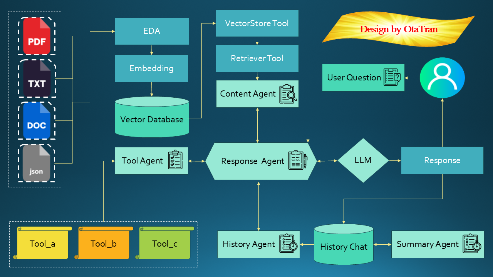
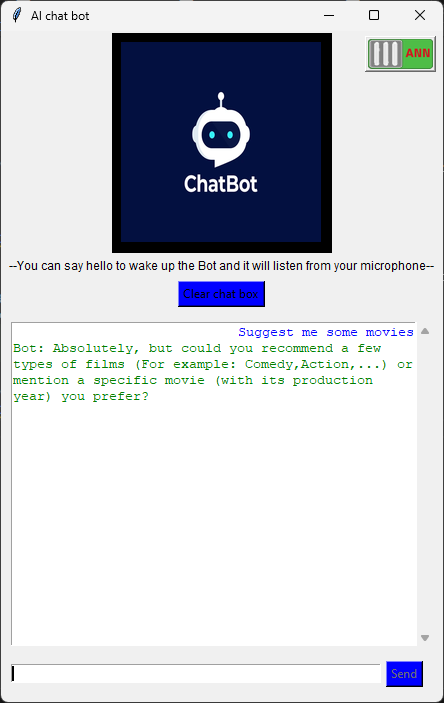

# **🌟 AI_Assistant App 🌟**

## **Description**

   - This application is a chatbot developed by Trần Đức Thuận.  
   - You can interact with the application both by voice and through the chatbox.  
   - The supported languages are English and Vietnamese.  
   - Since this is a personal project, many other interesting features will be updated in the future. Thank you for following the project.
   - This will help you [Installation and Usage](#Installation-and-Usage) and if convenient, you can provide feedback at [Contributing](#Contributing)  


## **App features**
## Table of features

✅ [Chat bot mode 1 (ANN)](#Chat-bot-Mode-1)  
✅ [Chat bot mode 2 (Agentic RAG)](#Chat-bot-Mode-2)  
✅ [Remove background from image](#Remove-background-from-image)  
✅ [Voice control (Speech to text)](#Voice-control-Speech-to-text)  
✅ [Movie recommendations](#Movie-recommendations)  
✅ [Age prediction](#Age-prediction)  
✅ [Respond with voice (text to speech)](#Respond-with-voice-text-to-speech)  
✅ [Open and close application](#Open-and-close-application)  
✅ [Google custom search](#Google-custom-search)  
✅ [Some commands](#Some-commands)  

## Chat bot (Mode 1)

   - This is a system that uses an ANN model to answer specific questions with clear results, while also conveniently utilizing the accompanying functions.  
     For example: What can you do?, Who are you?, open Notepad, ...
   - Particularly, it can answer medical questions.  
     For example: What to do if my muscle is pulled?, Which medicine to take if I get bleeding?, ...  


## Chat bot (Mode 2)
   - This is an Agentic RAG system capable of utilizing various tools and enhancing knowledge based on private data provided in the `datas/Rag_datas` folder, following the workflow below:



   - In this mode, you can use Vietnamese completely, switch to LLM answering mode using a toggle button in the top right corner.


## Remove background from image

   - You can upload an image, and the application will use a Generator model trained by a GAN network to remove the background from the image. You can then save it using the Save Image button.
   - You can refer to how i built this model [Remove_background_with_GAN_network](https://github.com/OtaTran241/Remove_Background_With_GAN)  
     
   

## Voice control (Speech to text)

   - You can say 'hello' to switch the bot to listening mode, and then ask whatever you like.  

   - All bot functionalities are accessible through two methods: chat or voice.  

 


## Movie recommendations

   - Movie recommendations is a function that suggests based on user requests.  
   - The movie recommendation model is built using linear_kernel in the scikit-learn library, suggesting by calculating similarity between feature vectors of movies provided by the user, or suggesting based on genres and returning the top 10 highest-rated movies.
   - You can refer to how i built this model [Movie recommendation](https://github.com/OtaTran241/Movies_Recommendation)


## Age prediction
   - Age prediction is a feature that predicting the user's age through voice using CNN.  
   - The age prediction model uses a Convolutional Neural Network model built using the TensorFlow library. The model makes predictions by processing the input audio and returns results based on its trained parameters.
   - You can refer to how i built this model [Age prediction](https://github.com/OtaTran241/Age_Prediction)


## Respond with voice (text to speech)

   - Bot will read out the answer using text-to-speech. (This function only works when you use voice commands)  

## Open and close application

   - It is a feature to open and close applications based on their names.  
   - The function is built using the psutil library and subprocess to find and terminate processes of applications, or automatically open applications using PowerShell.  


## Google custom search

   - It is a search feature based on Google's custom search API.  
   - It uses the results obtained through the BeautifulSoup library to parse the HTML and XML syntax of documents, and then returns the results to the user.  


## Some commands

#### Google search

   - To search Google and return results, you can use the chatbox or voice with the phrase 'google search' at the beginning.  
      For example: google search what is python, google search GDP of Viet Nam, ...  


#### Movie recommendations

   - To have the bot suggest movies, you need to command the bot to recommend movies for you.  
      For example: Suggest me some movies, Could you recommend a few good movies, ...  



   - After that, you can guide the bot by specifying genres or the names of movies you like along with their release year.  
      For example: 'action, drama', 'romance, war', Toy Story (1995), Wings (1927), ...  


#### Age prediction

   - To predict your age, you need to command the bot to predict your age.  
      For example: predict my age, Can you guess my age ?, ...  


   - Then the bot will switch to listening mode, and you can say something into the microphone, for example: 'hello, I'm from Vietnam', for the bot to proceed with the prediction.  


#### Open or Close application 

   - To open or close an app, you need to type or say 'open' or 'close' followed by the name of the app you want to open or close.  
      For example: open UniKey, open Google Chrome, close Notepad, close Edge, ...  


## **Installation and Usage**

#### Download file
   - First, to use it, you need to use the command:
     ```bash
     Git clone https://github.com/OtaTran241/AI_Assistant.git
     cd AI_Assistant
     ```  
   - Then you need to download the `Models.zip` file from this drive [here](https://drive.google.com/file/d/1LPQdwVF1K_06G2woTkkRCYjMD3gIkymZ/view?usp=sharing).

#### Extract file

   - After downloading, you just need to extract the `Models.zip` file in the `AI_Assistant` folder that you just cloned from GitHub.

#### Get API

   - After that, you need to obtain an API key from Google to use the custom search feature. You can find the API key [here](https://programmablesearchengine.google.com/controlpanel/all) and the Custom Search Engine ID [here](https://programmablesearchengine.google.com/controlpanel/all) then replace it in Custom_Search_API_Key and Custom_Search_Engine_ID in the `.env` file to use google custom search tool.
   - And you also need to get the API Key [here](https://ai.google.dev/gemini-api/docs/api-key?hl=vi) then replace it in Google_API_Key in the `.env` file to use mode 2 (Agentic Rag).

#### Install the requirements.txt file

   - Finally, you need to install the necessary libraries using the command:
     ```bash
     pip install -r requirements.txt
     ```

#### Run

   - Once all the installation steps are completed, you can run your own AI assistant by executing the file `Main.py` using the command:
     ```bash
     python src/Main.py
     ```
     
## **Contributing**
Contributions are welcome! If you have any ideas for improving the model or adding new features, feel free to submit a pull request or send an email to [tranducthuan220401@gmail.com](mailto:tranducthuan220401@gmail.com).
